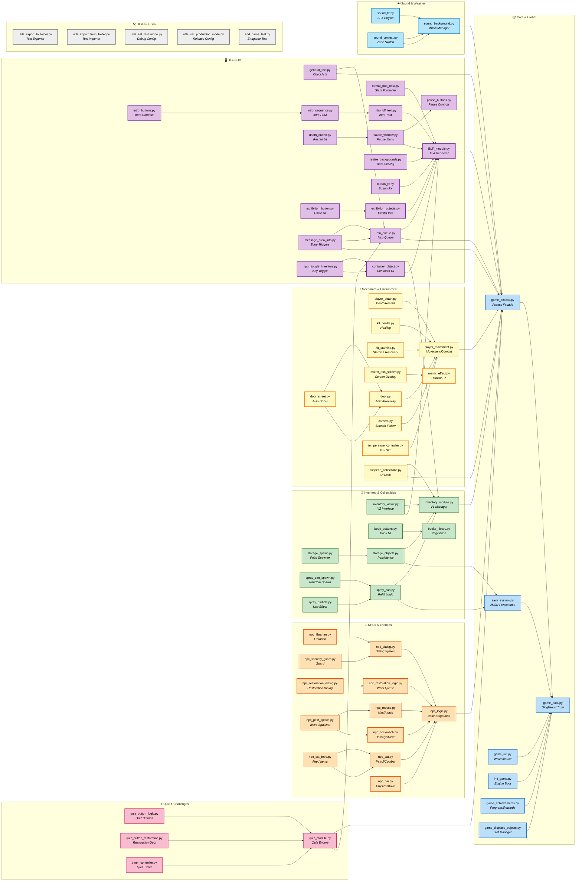

### How to interpret the architectural flow

- **Core (📦):** It is the central core. All systems read/write state through `game_data.py` or `game_access.py`.
- **UI (🖥️):** Renders and formats data. Depends on the Core to read statistics, but does not directly modify game logic.
- **NPCs (👾):** Manages AI and dialogs. Reports progress to the Core and receives spawn/state data.
- **Inventory (🎒):** Handles items and persistence. Communicates with the Core to save/load and with the UI to render.
- **Mechanics (⚡):** Physics, combat, and environment. Heavily depends on the Core and feeds data to the UI (e.g., health/stamina bars).
- **Sound (🔊) and Quiz (❓):** Specialized systems integrated via `game_access.py` and `save_system.py`.
- **Utilities (🛠️):** Development tools. Only interact with the Core for configuration or export.
